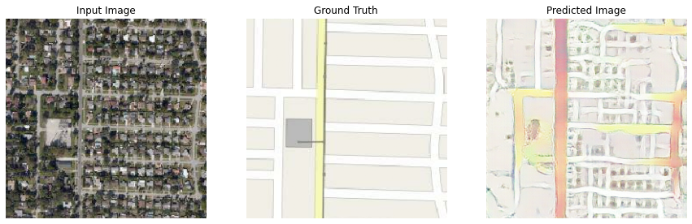

# Aerial to Street Map

### Purpose
This project is to create an Machine Learning Model to perform image-to-image translation from aerial satellite image to street map image, using only aerial satellite image. This use Pix2Pix base design.

## Training Process
1. Input image gets split into aerial and street map. 
2. The aerial image gets fed to the generator. 
3. Generators run the aerial image through the model to generate a map tile using U-Net neural network
4. The discriminator determines if the input image is real or generated image and evaluate the score based on the likelihood.
5. The score then used by the generator to improve itself. 

## Result
Baseline Pix2Pix

Version 6

Version 10

Version 15

Version 17

### Webpage

## How to Run

For webserver you need:
1. FrontEnd
2. Webserver
3. ImageGenerator Server(if need new data)

### FrontEnd
- in FrontEnd folder
- Require node 10 and up for react
- run: npm start

### ImageGenerator Server
- Requires:
    - Tensorflow
    - Zerorpc
    - Need really good GPU
- run: python imagebuilder_server.py -p <portnumber> -v <version number>
- ex: python imagebuilder_server.py -p 4015 -v 15

### Webserver
- Running on Node 8.17.0
- in ./webserver/index.js <port>

### ImageHarverstor/Organizer
- This is use as a tool to gather training data base on the config
- Not require for running the service

### Traing Code
- This is a traning code which need to be config to get the right dataset.
- Require a powerful machine
    - Training with 3000 images take at least 6 hour on 3 Tesla GPU cluster

### Notebook
- Collection of Jupyter Notebook which will show what the service can do.

### Checkpoint
- Trained model checkpoin that can be directly resume in testing and runnning